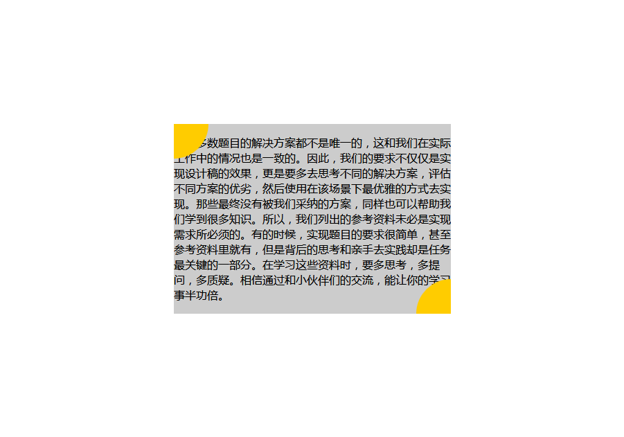

# 任务四：定位和居中问题

## 任务目标

- 实践HTML/CSS布局方式
- 深入了解position等CSS属性

## 任务描述

- 实现如 [示例图（点击打开）](http://7xrp04.com1.z0.glb.clouddn.com/task_1_4_1.png) 的效果
- 灰色元素水平垂直居中，有两个四分之一圆位于其左上角和右下角。

## 注意事项

- 思考不同情况下（如灰色高度是根据内容动态变化的）水平垂直居中的解决方案。
- 动手试一试各种情况的组合，父元素和子元素分别取不同的 position 值。思考 position 属性各种取值的真正含义，尤其是 absolute 究竟是相对谁而言的。
- 注意测试不同情况，尤其是极端情况下的效果。
- 调节浏览器宽度，灰色元素始终水平居中。
- 调节浏览器高度，灰色元素始终垂直居中。
- 调节浏览器高度和宽度，黄色扇形的定位始终准确。

## 解决方案

实际就是使某一容器元素水平垂直居中，然后其内部的两个元素分别位于左上角和右下角；

### 方案一

对于**固定宽高**的元素来说，可以利用`position`属性定位（`absolute`和`fixed`皆可）到屏幕中心这个位置（即`left`和`top`都为`50%`），再利用负边距将元素本身移到正中央的位置，即`margin-left:-200px`和`margin-top:-100px`（负的`50%`宽高距离）；内部元素可以利用绝对定位，需要注意的是画圆可以利用`border-raduis`属性，将其设为`50%`即可得到圆形元素（这个`50%`是相对于元素本身的宽高而言的，相当于半径）；

### 方案二

对于不定宽高的元素，也可以按照上述方案先将其定位到屏幕中心，再利用css3新属性`transform`中的`translate`功能平移元素，平移到正中央即为`translate(-50%, -50%)`，在`translate`中的百分比是**相对于元素本身的宽高**而言的，所以固定宽高和不定宽高都可适用；需要注意的是`IE8`及以下不支持`transform`属性！

### 方案三

这种方法有点怪异，先把元素设定为绝对或固定定位，然后再将`left,right,top,bottom`全部设为`0`，最后设置`margin`为`auto`即可实现水平垂直居中；

### 其他方案

也可以利用`flex`布局，通过在外面增加一个`flex`容器盒子，然后将盒子的`flex-direction`和`align-items`都设为`center`即可实现自适应宽高的水平垂直居中。