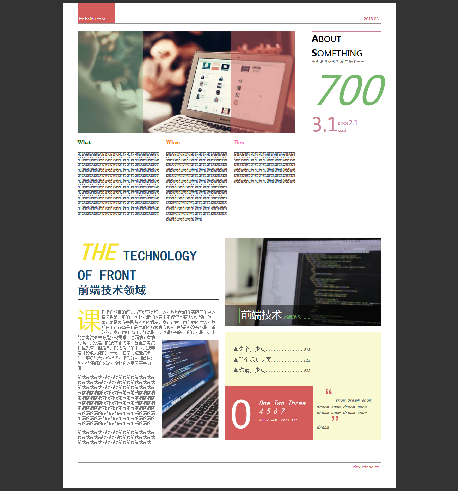

# 任务六：通过HTML及CSS模拟报纸排版

## 任务目的

- 深入掌握CSS中的字体、背景、颜色等属性的设置
- 进一步练习CSS布局

## 任务描述

- 参考 [PDS设计稿（点击下载）](http://7xrp04.com1.z0.glb.clouddn.com/task_1_6_1.psd)，实现页面开发，要求实现效果与 [样例（点击查看）](http://7xrp04.com1.z0.glb.clouddn.com/task_1_6_2.jpg) 基本一致
- 页面中的各字体大小，内外边距等可参看 [标注图（点击查看）](http://7xrp04.com1.z0.glb.clouddn.com/task_1_6_3.jpg)
- 页面宽度固定（定宽）

## 任务注意事项

- 只需要完成HTML，CSS代码编写，不需要写JavaScript
- 设计稿中的图片、文案均可自行设定
- 在Chrome中完美实现符合标注中的各项说明
- 有能力的同学可以尝试跨浏览器的兼容性
- 有能力的同学可以在实现一遍后尝试用less, sass或者stylus等再实现一次

## 实现

### 布局

从设计图不难看出，整体可以分为页眉、主体和页脚部分；最复杂的部分就是主体部分，可以大致分为3块：

1. 图片和各种数字放在一个容器中
2. What，When，How三段相似风格的文字可以放在一个容器中
3. 最下面的文章和图片可以看作一个两栏式的布局

### 细节

每个容器的布局都是两栏或三栏，可以采用`flex`布局，也可以用`position`来定位；由于全是固定宽度的元素，所以可以直接采用相对定位的容器中放置元素，中间三栏的文字可以采用`flex`布局；

除了对布局的考察之外，最多的就是对字体格式的控制，如：字体，字体大小，字体粗细，段落间距，颜色等等；

### 坑

1. 在使用标题标签（即`h1`到`h6`）时，要注意其默认的属性，盲目使用则会附带不需要的字体效果！
2. 最好使用reset样式，一个一个元素重置很麻烦
3. 最好先按照图纸对容器进行划分，对于固定宽度的这种布局可以采用`relative`和`absolute`交叉使用，然后算出宽度，也可以用浮动
4. css代码量略大，可以尝试使用sass替代！

### 完成效果

## css字体设置

| 属性               | 描述                                     |
| ---------------- | -------------------------------------- |
| font             | 简写属性。作用是把所有针对字体的属性设置在一个声明中。            |
| font-family      | 设置字体系列。                                |
| font-size        | 设置字体的尺寸。                               |
| font-size-adjust | 当首选字体不可用时，对替换字体进行智能缩放。（CSS2.1 已删除该属性。） |
| font-stretch     | 对字体进行水平拉伸。（CSS2.1 已删除该属性。）             |
| font-style       | 设置字体风格。                                |
| font-variant     | 以小型大写字体或者正常字体显示文本。                     |
| font-weight      | 设置字体的粗细。                               |
| color            | 设置前景（即字体）颜色                            |

来源：[http://www.w3school.com.cn/css/css_font.asp](http://www.w3school.com.cn/css/css_font.asp)

### 常用字体名称

| 字体中文名     | 对应英文名              |
| --------- | ------------------ |
| 宋体        | SimSun             |
| 黑体        | SimHei             |
| 微软雅黑      | Microsoft YaHei    |
| 微软正黑体     | Microsoft JhengHei |
| 新宋体       | NSimSun            |
| 新细明体      | PMingLiU           |
| 细明体       | MingLiU            |
| 标楷体       | DFKai-SB           |
| 仿宋        | FangSong           |
| 楷体        | KaiTi              |
| 仿宋_GB2312 | FangSong_GB2312    |
| 楷体_GB2312 | KaiTi_GB2312       |

来源：[HTML，CSS，font-family：中文字体的英文名称 （宋体 微软雅黑） - ithink-设计-Design](http://www.xwbetter.com/font-family/)

