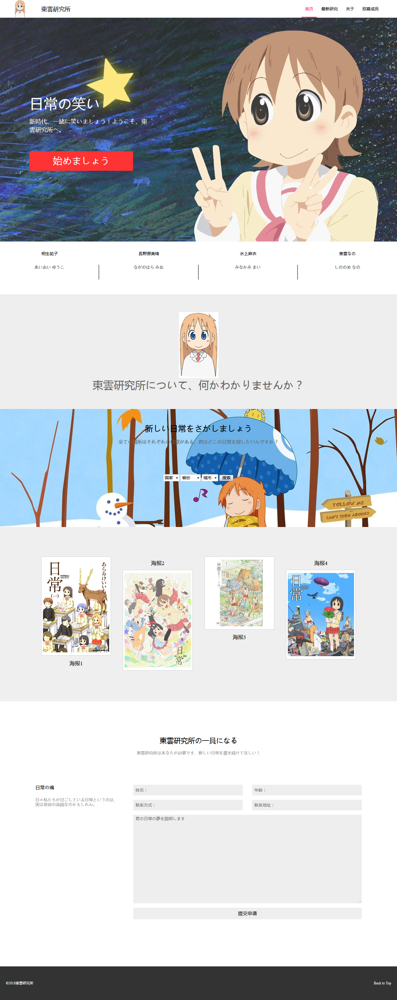

# 任务七：实现常见的技术产品官网的页面架构及样式布局

## 任务目的

- 通过实现一个常见的技术产品官网，加深对于HTML，CSS的实战能力
- 学习掌握如何在没有标注的情况下实现设计稿到页面的精确转变

## 任务描述

- 通过HTML及CSS实现设计稿 [设计稿PSD文件（点击下载）](http://7xrp04.com1.z0.glb.clouddn.com/task_1_7_1.psd)，效果如 [效果图（点击打开）](http://7xrp04.com1.z0.glb.clouddn.com/task_1_7_2.jpg)

- 设计稿是有一定宽度的，这个宽度为页面的最小宽度，也就是说，当浏览器窗口宽度小于设计稿宽度时，允许出现横向滚动条，页面内容宽度保持不变，但是当浏览器窗口宽度大于设计稿宽度时，页面部分内容的宽度应该保持和浏览器窗口宽度一致，具体哪些部分题目不做具体指明，看看大家的判断如何。

  

## 任务注意事项

- 只需要完成HTML，CSS代码编写，不需要写JavaScript
- 设计稿中的图片、文案均可自行设定
- 在Chrome中完美实现与设计稿的各项字体、布局、内外边距等样式
- 有能力的同学可以尝试跨浏览器的兼容性
- 有能力的同学可以在实现一遍后尝试用less, sass或者stylus等再实现一次

## 实现

此次实现并没有完全按照所提供的稿纸进行，不过总体布局是一致，只是把内容换了一下；没办法，『日常』这部番突然就出现在脑海中了，『東雲研究所』这种设定跃然纸上，有些图暂时懒得找了，就随便先把布局搭好，然后换了一些日文。初步完成大概是这个样子：



有些部分还未完成，不过总体来看还是挺相似的；不像task6那样细节特别多，该任务注重整体与局部的展示，整个来看显得简洁清新，布局很整齐；

可以大胆的使用`flex`布局，大部分都能适用；


## 坑

实现的时候还是有些小坑要注意：

1. `a`标签的默认颜色是继承浏览器的，如果不直接对其设置`color`属性，是无法改变其默认颜色的；所以想要让`a`标签直接继承父元素的`color`属性，可以这么设置：

   ```css
   a{
       color: inherit;
   }
   ```

2. `line-height`设置为`100%`并非指的是其自身高度`height`属性的百分比，而是字体大小的百分比？所以不能直接设置`line-height`为`100%`来使文字垂直居中！

3. 想要让顶部导航条固定显示，仅仅设置`position: fixed`是不够的，这样只要一滚动就有可能会被下面的**绝对或相对定位的元素**所覆盖，因此还需要将导航条的`z-index`设置很大才行；